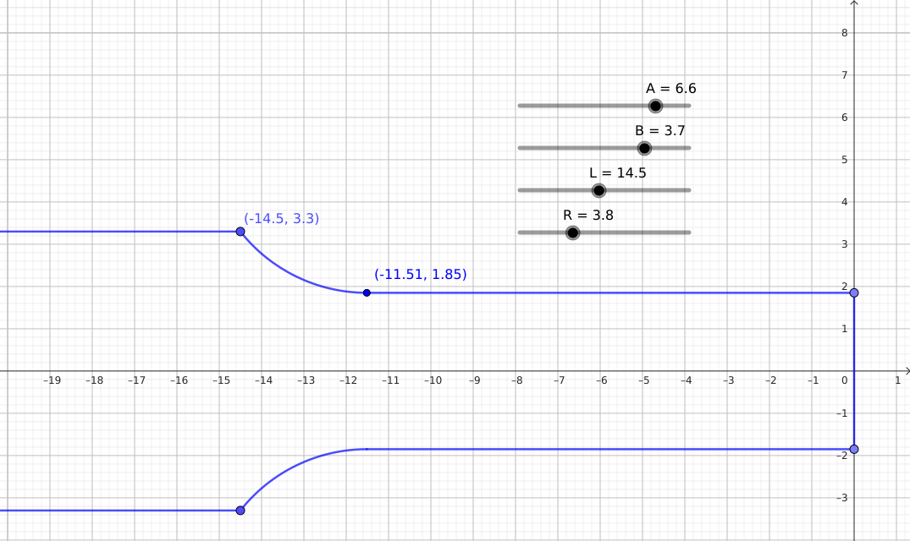

# tube-outline
Geometrical verification of a function. The function describes the outline of a tube.

## Requirements
Install geogebra

## Usage
Open the drawing.ggb file with geogebra

## Used geogebra version for construction
GeoGebra 5.0.785.0 20 June 2023 Java 21.0.3-64bit

## Preview

